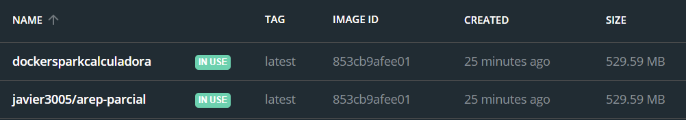
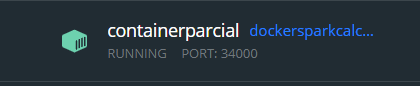
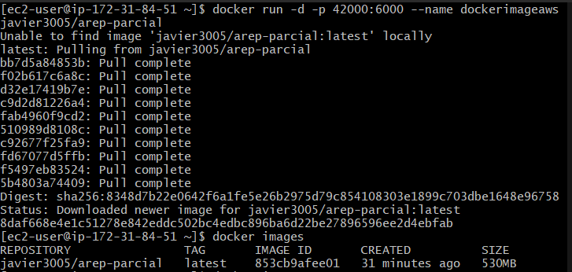
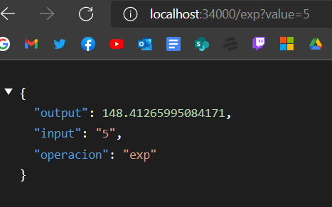
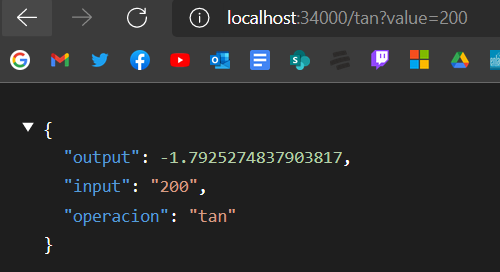
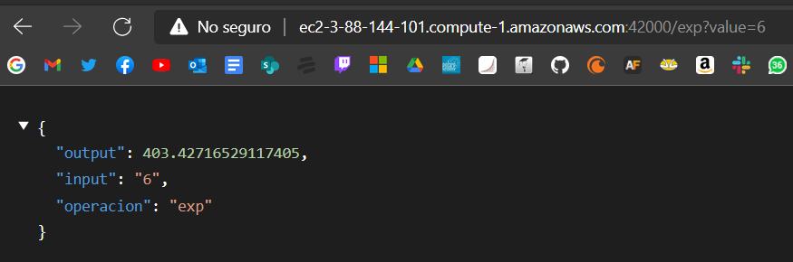
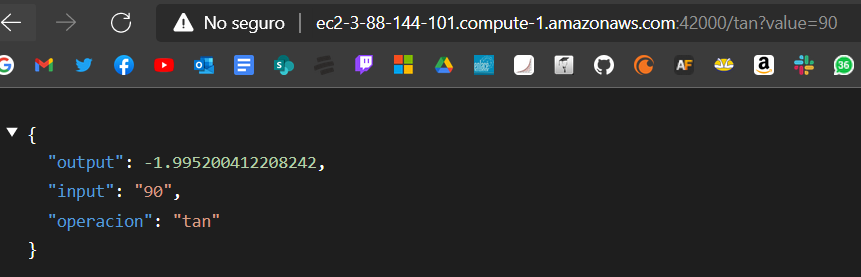

# AREP PARCIAL CALCULADORA
Funciones asignadas
- Tangente (tan(x)))
- Exponencial (e^x)

## Autor
* Javier Esteban López Peña

## Contrucción
* NetBeans - Editor de código y ambiente de desarrollo
* Maven - Gestor de dependencias
* Docker 
* AWS Cloud

## Prerequisites
* Docker - Container Manager
* Java 8 - Development Environment
* Git - Version Control System
* Spark - Micro framework para creación de aplicaciones

## Screenshots

Imagenes en Docker



Container en Docker 



Corriendo Docker en el AWS



Pruebas en Docker local





Pruebas en Docker en AWS





## Instrucciones AWS
1. Acceda a la máquina virtual e instale Docker

```
sudo yum install docker
```

2. Inicie el servicio de docker

```
sudo service docker start
```

3. Configure su usuario en el grupo de docker para no tener que ingresar “sudo” cada vez que invoca un comando

```
sudo usermod -a -G docker ec2-user
```

4. Desconectes de la máquina virtual e ingrese nuevamente para que la configuración de grupos de usuarios tenga efecto. A partir de la imagen creada en Dockerhub cree una instancia de un contenedor docker independiente de la consola (opción “-d”) y con el puerto 6000 enlazado a un puerto físico de su máquina (opción -p):

```
docker run -d -p 42000:6000 --name dockerimageaws javier3005/arep-parcial
```

5. Abra los puertos de entrada del security group de la máxima virtual para acceder al servicio

6. Ya se puede iniciar desde su link AWS y probarlo

Tangente http://ec2-3-88-144-101.compute-1.amazonaws.com:42000/tan?value=90
Exponencial http://ec2-3-88-144-101.compute-1.amazonaws.com:42000/exp?value=90

## Instrucciones Local

1. Clonar el repositorio

```
git clone https://github.com/Javier200151/AREP-PARCIAL2
```

2. Compilar/Construir el proyecto

```
mvn clean install
```

3. Construir la imagen Docker

```
docker build --tag dockersparkcalculadora .
```

4. Para ver que quedo usemos

```
docker images
```

5. Corremos el contenedor con la imagen creada

```
docker run -d -p 34000:6000 --name dockercontainer dockersparkcalculadora
```

6. Para probarlo usa

Tangente localhost:34000/tan?value=10
Exponencial localhost:34000/exp?value=10

## Docker https://hub.docker.com/repository/docker/javier3005/arep-parcial
## Video https://youtu.be/pLMGWHEBCU8
